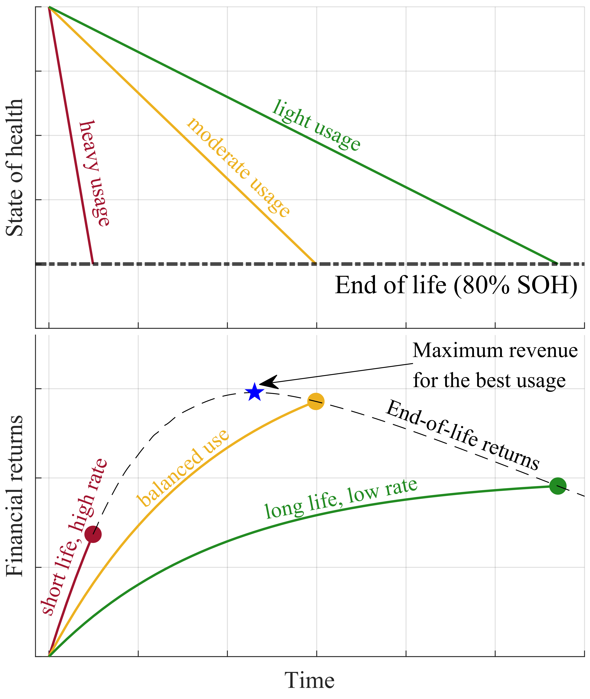

# BatteryOpportunity
Battery Opportunity Cost Minimisation

This is a study to understand the value of battery degradation for energy arbitrage operation. It involves a toy model and long-term rolling horizon optimisation. For detailed information please refer to the paper:

[Depreciation Cost is a Poor Proxy for Revenue Lost to Aging in Grid Storage Optimization](https://arxiv.org/pdf/2403.10617)

Kumtepeli, Volkan and Hesse, Holger and Morstyn, Thomas and Nosratabadi, Seyyed Mostafa and Aunedi, Marko and Howey, David. A.

Also see the project website: [EPSRC-DIGEST](https://epsrc-digest.github.io/)

# Abstract

Dispatch of a grid energy storage system for arbitrage is typically formulated into a rolling-horizon optimization problem that includes a battery aging model within the cost function. Quantifying degradation as a depreciation cost in the objective can increase overall profits by extending lifetime. However, depreciation is just a proxy metric for battery aging; it is used because simulating the entire system life is challenging due to computational complexity and the absence of decades of future data. In cases where the depreciation cost does not match the loss of possible future revenue, different optimal usage profiles result and this reduces overall profit significantly compared to the best case (e.g., by 30–50%). Representing battery degradation perfectly within the rollinghorizon optimization does not resolve this—in addition, the economic cost of degradation throughout life should be carefully considered. For energy arbitrage, optimal economic dispatch requires a trade-off between overuse, leading to high return rate but short lifetime, vs. underuse, leading to a long but not profitable life. We reveal the intuition behind selecting representative costs for the objective function, and propose a simple moving average filter method to estimate degradation cost. Results show that this better captures peak revenue, assuming reliable price forecasts are available.

# Files to run: 

- `sensitivity_analysis.py` : Runs sensitivity analyses
- `sensitivity_analysis_gurobipy.py`: Nearly same as `sensitivity_analysis.py` but uses gurobipy library instead of cvxpy.

# Dependencies

This library uses Python for optimisation and MATLAB for plotting. Unfortunately, I am better at plotting in MATLAB and didn't have much time to recreate MATLAB plotting functions in Python.

## MATLAB:

- [tight_subplot](https://uk.mathworks.com/matlabcentral/fileexchange/27991-tight_subplot-nh-nw-gap-marg_h-marg_w)

- [coord2norm](https://github.com/StackOverflowMATLABchat/coordinate2normalized)

- https://github.com/StackOverflowMATLABchat/coordinate2normalized

- [cmocean](https://www.mathworks.com/matlabcentral/fileexchange/57773-cmocean-perceptually-uniform-colormaps)

- [viridis](https://uk.mathworks.com/matlabcentral/fileexchange/51986-perceptually-uniform-colormaps)

## Python:

See [requirements.txt](requirements.txt)
